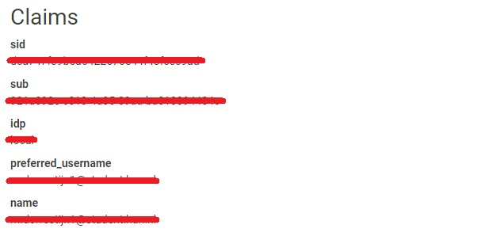

# Role based authorization with IdentityServer4

In this tutorial we will explain how you can add roles to your IdentityServer4 project.

## Before you begin
- Make sure you followed the [Kubernerds workshop](https://gitlab.com/kubernerds/workshop-identityserver-4/tree/master) on how to get started with IdentityServer4.
- Make sure that you have registered two users. For this guide I created a user with the email admin@example.com (which we will make admin) and default@example.com (which we will make a default user)

## Adding roles to the database
Before we can even use role management with IdentityServer4 we need to add the roles to our database. In order to achieve this we will go to the `startup.cs` file in the `IdentityServer` project.
Under the `Configure` method you have to create this method.

```csharp
private async Task CreateRoles(IServiceProvider serviceProvider) {
    var RoleManager = serviceProvider.GetRequiredService<RoleManager<IdentityRole>>();
    var UserManager = serviceProvider.GetRequiredService<UserManager<ApplicationUser>>();

    IdentityResult adminRoleResult;
    bool adminRoleExists = await RoleManager.RoleExistsAsync("Admin");

    if (!adminRoleExists) {
        adminRoleResult = await RoleManager.CreateAsync(new IdentityRole("Admin"));
    }

    ApplicationUser userToMakeAdmin = await UserManager.FindByNameAsync("<<THE USERNAME YOU WANT TO MAKE ADMIN>>");
    await UserManager.AddToRoleAsync(userToMakeAdmin, "Admin");
}
```
This method will check if there is an Admin role in the database and create it if its not there. Next it will look for a username to make Admin. If the username is not found it will throw an exception. Make sure you place the username that you want to make Admin is filled in at `<<THE USERNAME YOU WANT TO MAKE ADMIN>>`. In my case this will be `admin@example.com`

Next we need to call this method in the `Configure()` method of the same file. In the `Configure()` method you have to add `IServiceProvider services` as a second parameter and call `CreateUserRoles(services).Wait();` at the end. You're `Configure` method will look similar to this.

```csharp
public void Configure(IApplicationBuilder app, IServiceProvider services){
    //Details omitted for simplicity
    CreateUserRoles(services).Wait();
}
```
Now you can build and run your IdentityServer project and look in the database. If everything went correctly you should see one record in the `AspNetRoles` table.

## Adding the role attribute to the claims

IdentityServer4 will generate a JSON-web-token (JWT) once you logged in successfully. This JWT consists of claims. If you copy the contents of the [secure page](https://gitlab.com/kubernerds/workshop-identityserver-4/blob/master/part4_client/InsideAirbnb/Views/Home/Secure.cshtml) from the Kubernerds workshop, log in and navigate to that page you can see that the default claims are `sid`, `sub`, `idp`, `preferred_username` and `name`.



We need to add the `Role` claim to this list of claims. In order to do this create a new folder within your IdentityServer project called `Services`. In here we will create a new class called `ProfileService.cs`. This class will have to implement the interface `IProfileService`

`IProfileService` contains the methods that take care of adding additional  claims to our default list of claims. There is only one method however that we have to modify, and that's the `GetProfileDataAsync` method. In this method we have to find the Role claim and add it to the list of claims. This we can do using the `AddRage` method. Your Profile service class should look like this.

```csharp
public class ProfileService : IProfileService {
    public ProfileService() { }
    public Task GetProfileDataAsync(ProfileDataRequestContext context) {
        var roleClaims = context.Subject.FindAll(JwtClaimTypes.Role);
        context.IssuedClaims.AddRange(roleClaims);
        return Task.CompletedTask;
    }

    public Task IsActiveAsync(IsActiveContext context) {
        return Task.CompletedTask;
    }
}
```
Next we need to tell IdentityServer to call this class everytime we request role data. In order to do this we will have too add the following line in our `Startup.cs` file within the `ConfigureServices(IServiceCollection services)` method.

```csharp
services.AddTransient<IProfileService, ProfileService>();
```

## Returning the modified claims in our API

So far so good. In order to return the modified claims (the default claims + the role claim) we will have to instruct our API to do so. Go to your `Config.cs` and in the `GetIdentityResources()` method you will have to add a new IdentityResource that includes our role. This can be done by adding the following line `new IdentityResource("roles", new[] { "role" })`. The full `GetIdentityResources()` method should look something like this.

```csharp
public static IEnumerable<IdentityResource> GetIdentityResources() {
  return new IdentityResource[] {
      new IdentityResources.OpenId(),
      new IdentityResources.Profile(),
      new IdentityResource("roles", new[] { "role" }) //Add this line
  };
}
```

Next we will add this IdentityResource to the API that we are using. If you followed the Kubernerds workshop you will be using the MVC client. Within the same class navigate to the `GetClients()` method and add `roles` to the allowed scope. In the end the MVC client should look something like this.

```csharp
new Client {
    ClientId = "mvc",
    ClientName = "MVC Client",

    AllowedGrantTypes = GrantTypes.Implicit,

    //Details omitted for simplicity

    AllowedScopes = { "openid", "profile", "api1", "roles" } //Add "roles" here
},
```

Now the role claim is sent back once a user is signed in. However our InsideAirbnb project doesn't know anything about the role claims and will not listen for it. This is what we have to configure next.

## Hooking up roles to InsideAirbnb

In order to make our InsideAirbnb project understand that it should add the roles we need to explicitly tell it to do so. In order to do this go to your InsideAirbnb project and open the `Startup.cs` file. In the `ConfigureServices()` method should have a call to the `AddAuthentication(options => {}).AddCookie("").AddOpenIdConnect("oidc", options => {})` method somewhere.

Before all this make sure you clear the token using `JwtSecurityTokenHandler.DefaultInboundClaimTypeMap.Clear();` and add the following to the `options` in the `AddOpenIdConnect()` method.

```csharp
options.Scope.Add("roles");
options.ClaimActions.MapJsonKey("role", "role", "role");
options.TokenValidationParameters.RoleClaimType = "role";
```

This will add the IdentityResource "roles" to our claims and add the "role" parameter with the name of "role". Next it will set the claimType to "role" so the InsideAirbnb project will know that that's the key to look for if it needs to authenticate a user's role. The full code should look something like this.

```csharp
JwtSecurityTokenHandler.DefaultInboundClaimTypeMap.Clear();

services.AddAuthentication(options => {
    options.DefaultScheme = "Cookies";
    options.DefaultChallengeScheme = "oidc";
})
.AddCookie("Cookies")
.AddOpenIdConnect("oidc", options => {
    //Details omitted for simplicity
    options.Scope.Add("roles"); //Add this
    options.ClaimActions.MapJsonKey("role", "role", "role"); //And this
    options.TokenValidationParameters.RoleClaimType = "role"; //And also this
});
```

## Testing it out

Make sure you build both your InsideAirbnb project and the IdentityServer project. If you login with the account you made admin you will see that the roles are added to the permission page. Once you inspect the claims on the Secure page you will see that that the role key is present.


## Restricting access
In order to restrict access to a entire route you can add the following on top of the route definition: `[Authorize(Roles = "Admin")]`. In order to check if a user has a specific role within the razor page you can include an if statement like so.

```csharp
<p>Every user will see this</p>

if (User.Identity.IsAuthenticated) {
  <p>Every logged in user will see this including the paragraph above</p>
}

if(User.IsInRole("Admin")) {
  <p>Only a user thats admin will see this + the paragraphs above</p>
}
```
Note: `Admin` will work here but not `ADMIN` or `admin`. It's case sensitive.

## Older IdentityServers
If you use IdentityServer3 or lower you will have to update the `[AspNetUsers]` table and set the value of the `[EmailConfirmed]` column to true in order for this to work.
